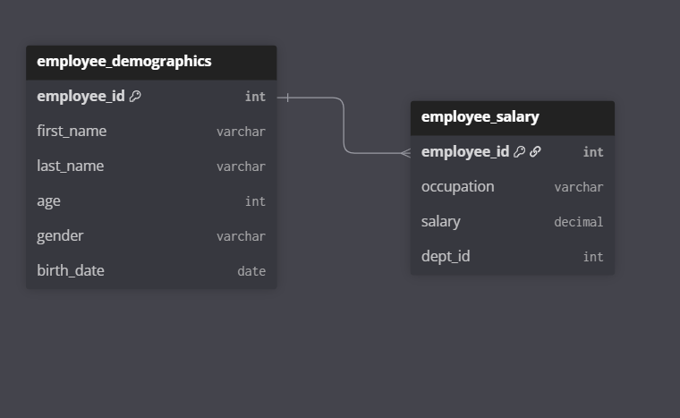

# HR-Analytics-SQL-Project

## Employee Database Schema

### Visual Diagram

An SQL-driven HR analytics project that examines salary distribution, gender pay gaps, and workforce age patterns to support data-driven decision-making in human resource management.

## Executive Summary  
This SQL project explores employee data to uncover insights about salaries, gender, departments, and age distribution across an organization.  
The goal is to understand how different factors — like occupation, gender, and age relate to compensation and workforce composition.  

## Business Problem  
Many organizations collect extensive HR data but rarely analyze it to make fair, informed, or data-driven decisions.  
Questions such as:  
- Which departments pay the highest average salaries?  
- Are men and women paid equally for similar roles?  
- What does the company’s age distribution look like?  

This analysis answers these questions using SQL,no extra tools, just logic and clean data manipulation.

## Methodology  
1. **Retrieve** all data from both the *employee_salary* and *employee_demographics* tables.  
2. **Join** both datasets on *employee_id* to combine job and personal information.  
3. Calculate the **average salary per department** to identify pay trends.  
4. Determine **occupations with the highest average salaries**.  
5. List the **top 5 highest-paid employees** and their job roles.  
6. Identify employees whose **total salary is above the company average**.  
7. Analyze the **gender pay gap** across occupations.  
8. Measure **gender distribution** across the organization.  
9. Group employees into **young** and **old** categories to observe age patterns by occupation.

These steps were completed using SQL functions like *AVG()*, *SUM()*, *CASE WHEN*, *GROUP BY*, and *GROUP_CONCAT()*.

## Skills Demonstrated  
- SQL Data Manipulation and Exploration  
- JOINs and Subqueries  
- Conditional Logic with *CASE WHEN*  
- Aggregation and Grouping  
- Data Categorization and Filtering  
- Business-Oriented Analytical Thinking

## Results and Insights  
- Some departments showed significantly higher average salaries, indicating possible pay concentration.  
- Noticeable **gender pay gaps** existed in some roles, suggesting room for review and correction.  
- The **age distribution** revealed younger employees dominating certain roles and older employees in more senior positions.  
- Identified the **top 5 earners** and roles contributing most to company payroll costs.

### Recommendations
- Conduct regular salary and gender pay audits to ensure fairness and transparency.  
- Introduce mentorship and succession programs to bridge the generational workforce gap.  
- Reassess payroll allocations to align high salaries with business value.

## Next Steps  
- Visualize findings using **Power BI** for better storytelling.  
- Add **year-over-year analysis** to monitor changes in salary or demographics.  
- Integrate education level, experience, or performance data for deeper insights.  
- Automate the SQL queries to produce routine workforce reports.

---

## Tools Used  
- **MYSQL**   
- **Excel**  
